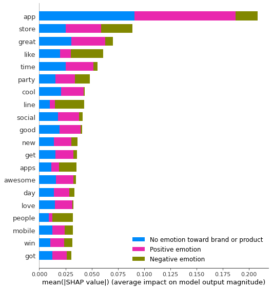

# Tweet Sentiment Analysis

## Overview
The goal of the project is to develop a classification model that classifies whether a tweet about a product or brand is positive, negative or neutral. 

## Repo Structure
- *001.Data_Cleaning.ipynb* Contains initial cleaning steps
- *010.Preprocessing_Feature_Engineering.ipynb* Contains full text preprocessing steps
- *020.Model_BoW.ipynb* Classification using count vectors and TF-IDF vectors
- *022.Model_RNN.ipynb* Classification using LSTM + Word Embedding
- *023.Model_BERT.ipynb* Classification using BERT through PyTorch (google colab)
- *custom_functions.py* Custom function used for BoW evaluation

## Data 
Data was sourced from [data.world](https://data.world/crowdflower/brands-and-product-emotions), which provided over 8000 tweets that have been classified to be whether positive, negative, or neutral by human contributors. 

After removing all tweets classified to be "I can't tell", the tweets were split into train, valid, test sets (7:1.5:1.5). Our final training data consists of 2,651 tweets with no emotion, 1,545 positive, and 292 negative. 

## NLP Preprocessing
A standard NLP preprocessing was applied. Details are as below...
1. Converted to lowercase
2. Removed HTML symbols, punctuations, digits, links, mentions
3. Any words that can bias the results removed (e.g. brand, product, event names)
4. Lemmatized using WordNetLemmatizer
5. Tokenized

In order to reduce overall dimensions, similarities between low frequency words and other words were computed and low-frequency words were replaced with the most similar word if their cosine similarity was above .8. 

Additionally, the percentage of capitalized characters, a number of exclamation points, question marks, links, mentions, tags were computed for additional analysis. 

## Evaluation
### Evaluation Metrics
Both sensitivity and precision are equally important in our business case, so I used f1-score as our evaluation metrics. I took the macro-average across all classes, as we have pretty significant class imbalance.

### Modeling
Largely I used the Bag of Words approach and the deep learning approach. 
For the Bag of Words models, I calculated the simple count vectors and TF-IDF vectors and ran it through the Naive Bayes and SVM. For deep learning approach, an LSTM model was tested with and without the [GloVe](https://nlp.stanford.edu/projects/glove/) word embedding weights (pretrained 200d Twitter data). Lastly BERT with PyTorch (on Google Colab) was tested.

## Results
| Model | Accuracy | Macro_F1 | Cohen's Kappa |
| --- | --- | --- | --- |
| Baseline | 0.48 | 0.34 | 0.01 | 
| Count Vectors + Naive Bayes | 0.55 | 0.45 | 0.21 |
| Count Vectors + SVM | 0.61 | 0.49 | 0.26 |
| TF-IDF + Naive Bayes | 0.55 | 0.47 | 0.24 |
| TF-IDF + SVM | 0.61 | 0.46 | 0.25 |
| LSTM + GloVe | **0.68** | 0.46 | **0.32** | 
| LSTM + GloVe iteration | 0.63 | **0.50** | 0.29 |
| BERT (PyTorch) | 0.67 | 0.48 | 0.31 |

Overall performance was not yet optimal. Generally the model sacrificed great deal of accuracy, trying to capture the minority class (negative emotion). The current approach will improve with more data especially with the negative emotion.

## Final model architecture
| Layer (type) | Output Shape | Param # |
| --- | --- | --- | 
| embedding_28 (Embedding) | (None, 19, 200) | 600000 |
| dropout_19 (Dropout) | (None, 19, 200) | 0 |
| lstm_28 (LSTM) | (None, 200) | 320800 |
| dense_50 (Dense) | (None, 200) | 40200 |
| dense_51 (Dense) | (None, 3) | 603 |

Final model showed overll 63% of accuracy with Cohen's Kappa of 0.29 and .50 macro-average F1-score. 

 

Looking at the Shapley value shows that words that contribute the most to negative emotion is rather ambiguous at this point.

## Future Direction
As discussed above, current model has a high variance issue due to small amount of negative emotion data. Collecting more data will improve our model further.
